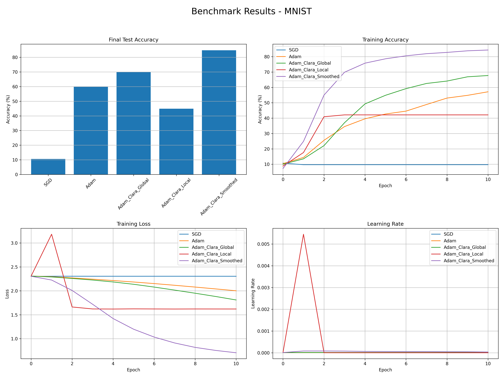

# Project Title

A brief description of your project, its purpose, and what it does.

## Table of Contents

- [Table of Contents](#table-of-contents)
- [Introduction](#introduction)
- [Installation](#installation)
- [Documentation](#documentation)
- [Results](#results)

## Introduction
Provide a detailed explanation of the project, its goals, and the problems it solves. Include any relevant background information.

## Installation
Step-by-step instructions to set up the project locally:

```bash
pip install torch==2.3.0 torchvision==0.18.0 torchdata datasets pyarrow
```

## Documentation

For more information on the different AdamClara versions, refer to the [Adam Clara Versions](docs/Adam_Clara_Versions.md) documentation.


## Results

